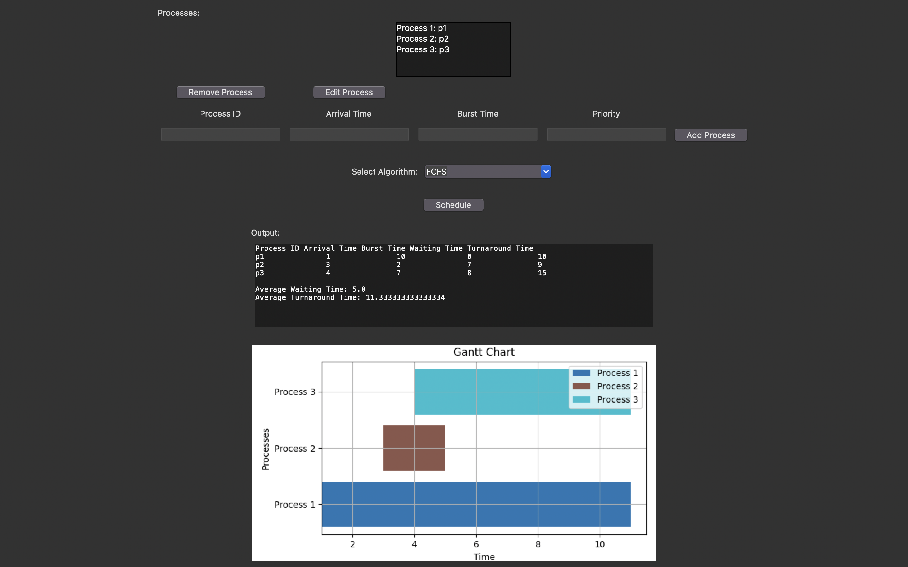
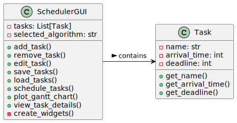

# Real-Time Process Scheduler

The Real-Time Task Scheduler GUI is a Python application that provides a graphical interface for managing and scheduling tasks using various real-time scheduling algorithms.



## UML Diagram


## Features

- **Task Management**: Add, edit, and remove tasks with an intuitive user interface. Each task includes a name, arrival time, and deadline.
  
- **Scheduling Algorithms**: Choose from different scheduling algorithms to schedule tasks. Supported algorithms include:
  - **Earliest Deadline First (EDF)**: Assigns priority based on the task's deadline. Tasks with the earliest deadlines are scheduled first to minimize deadline misses.
  
  - **Rate-Monotonic Scheduling (RMS)**: Assigns priorities based on task periods. Shorter period tasks have higher priority. RMS is optimal for periodic tasks with fixed execution times.
  
  - **First-Come, First-Served (FCFS)**: Schedules tasks in the order of their arrival. The first task that arrives is the first to be executed.
  
  - **Shortest Job Next (SJN)**: Selects the shortest job (task) from the ready queue for execution. SJN minimizes waiting time by executing shorter tasks first.
  
  - **Round Robin (RR)**: Assigns fixed time slices (quantum) to each task in a cyclic order. Tasks are executed for a fixed quantum, then moved to the back of the ready queue.
  
  - **Multilevel Queue (MLQ)**: Divides tasks into multiple priority levels or queues. Tasks are assigned to queues based on priority, and each queue has its scheduling algorithm.
  
  - **Multilevel Feedback Queue (MLFQ)**: Similar to MLQ but with dynamic priority adjustment. Tasks can move between queues based on their behavior and resource requirements.
  
  - **Priority Scheduling**: Assigns priorities to tasks based on some criteria (e.g., task importance). Higher priority tasks are scheduled before lower priority tasks.
  

- **Detailed Task Information**: View detailed information about tasks, including their current status, remaining time until deadline, and any scheduling conflicts that may arise.

- **File I/O**: Save and load task lists to/from files for easy data management and future use. Tasks are stored in a simple text format for compatibility and ease of access.

- **Gantt Chart Visualization**: Visualize the scheduling results through Gantt charts, providing a clear representation of task scheduling and resource utilization.

## Installation

1. **Clone the Repository**: Clone or download the repository to your local machine.

   ```
   git clone https://github.com/your_username/real-time-task-scheduler-gui.git
   ```

2. **Install Dependencies**: Make sure you have Python installed (preferably Python 3.x) and install the required dependencies using pip.

   ```
   pip install matplotlib
   ```

## Usage

1. **Run the Application**: Navigate to the project directory and run the `gui.py` file using Python.

   ```
   cd real-time-task-scheduler-gui
   python main.py
   ```

2. **Manage Tasks**: Use the graphical interface to add, edit, remove, save, and load tasks. Input task details such as name, arrival time, and deadline.

3. **Select Scheduling Algorithm**: Choose the desired scheduling algorithm from the dropdown menu. Available options include Earliest Deadline First (EDF), Rate-Monotonic Scheduling (RMS), First-Come, First-Served (FCFS), Shortest Job Next (SJN), Round Robin (RR), Multilevel Queue (MLQ), Multilevel Feedback Queue (MLFQ), and Priority Scheduling.

4. **Schedule Tasks**: Click the "Schedule" button to schedule the tasks using the selected algorithm. The output will be displayed in the text area, showing scheduling details and any missed deadlines.

5. **View Gantt Chart**: The application generates a Gantt chart to visualize the scheduling results, providing insights into task execution and resource utilization.

## Contributing

Contributions are welcome! If you have any suggestions, feature requests, or bug reports, please open an issue or submit a pull request. Your feedback and contributions are highly appreciated.


## Acknowledgments

This project was inspired by the need for a user-friendly tool to explore real-time task scheduling algorithms. Special thanks to the contributors and maintainers who have helped improve and maintain this project.
